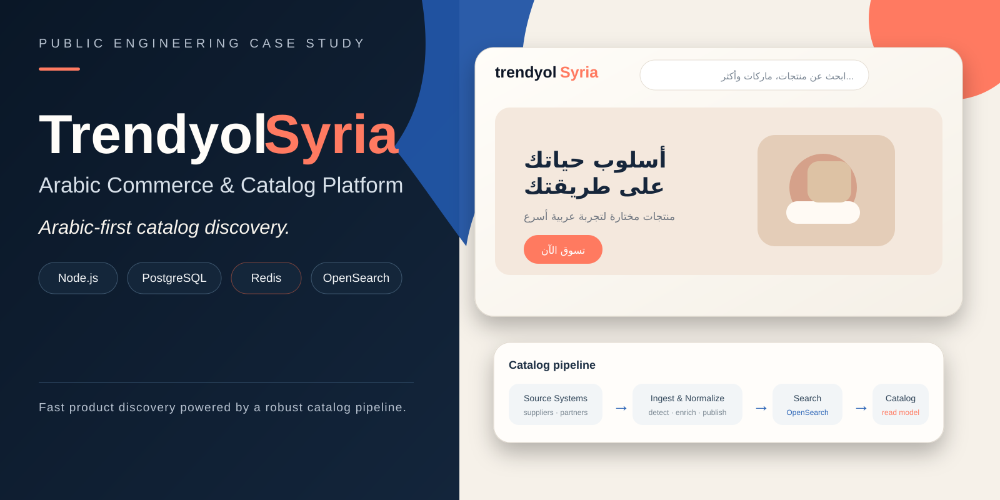
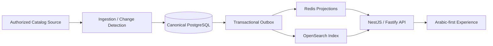

> **Visual overview:** conceptual case-study artwork based on the catalog, ingestion, and search architecture. It does not represent live product inventory, pricing, or production traffic.

# Trendyol Syria — Arabic Commerce & Catalog Platform

**Public engineering case study by [Levent Aydin](https://github.com/LEVENT-AY)**  
Senior Full-Stack, Mobile & AI Automation Engineer

> The production implementation is private. This repository documents architecture, reliability, and product-engineering decisions without publishing proprietary source code or source-access details.

## 30-second recruiter scan

- **System:** Arabic-first commerce/catalog platform with canonical PostgreSQL ingestion, transactional outbox processing, Redis read projections, OpenSearch indexing, and a fast product API.
- **My ownership:** ingestion model, canonical data, change detection, projections, search indexing, API delivery, idempotency, and reliability boundaries.
- **What it proves:** I can design data-intensive systems that isolate slow upstream synchronization from fast customer-facing reads and keep derived search/cache layers rebuildable.

## At a glance

| | |
|---|---|
| **Backend** | Node.js · NestJS · Fastify |
| **Canonical data** | PostgreSQL |
| **Read path** | Redis projections · OpenSearch |
| **Reliability** | Transactional outbox · idempotent processing |
| **Focus** | Ingestion · change detection · search · auditability |

## The engineering problem

A customer-facing commerce experience should not inherit the latency or availability of an upstream marketplace. Catalog synchronization and customer reads therefore operate as separate planes with different priorities.

The core principle is: **upstream latency may affect freshness, but it must not become customer-facing application latency**.

## Architecture

## What I built and owned

- Canonical PostgreSQL catalog model for authoritative product state.
- Field-level source-change detection before destructive updates.
- Transactional outbox separating canonical writes from downstream projections.
- Versioned Redis product projections for low-latency read paths.
- Deterministic OpenSearch indexing for catalog discovery.
- NestJS/Fastify API optimized around precomputed customer reads.
- Separation of ingestion and serving planes so synchronization load cannot degrade customer traffic.
- Idempotent processing and auditability across catalog transitions.

## Key engineering decisions

### Writes and reads solve different problems
Canonical storage prioritizes correctness and traceability; customer read models prioritize latency, searchability, and predictable response shape.

### Upstream dependency stays isolated
Synchronization is asynchronous, so a slow source affects freshness rather than basic application responsiveness.

### Search is derived, not canonical truth
OpenSearch improves discovery, but authoritative product state remains in PostgreSQL and the search index can be rebuilt deterministically.

## Technology

| Layer | Technology / focus |
|---|---|
| Canonical data | PostgreSQL |
| Backend | Node.js, NestJS, Fastify |
| Cache / read models | Redis |
| Search | OpenSearch |
| Reliability | Transactional outbox, idempotent processing |
| Product direction | Arabic-first / RTL-first commerce |

## What this demonstrates

Data-intensive system design: separating ingestion from serving, maintaining canonical truth, building low-latency projections, designing rebuildable search, and making retries safe by design.

---

**Source policy:** private for commercial and IP reasons. No proprietary source code, credentials, upstream access details, or private operational configuration are published here.

[← Back to my engineering profile](https://github.com/LEVENT-AY)
