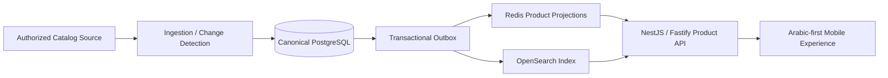

# Trendyol Syria — Arabic Commerce & Catalog Platform

**Public engineering case study by [Levent Aydin](https://github.com/LEVENT-AY)**  
Senior Full-Stack, Mobile & AI Automation Engineer

> The production implementation is private. This repository documents the architecture, reliability model and product-engineering decisions without publishing proprietary source code or source-access details.

## At a glance

| | |
|---|---|
| **Product type** | Arabic-first commerce and mirrored catalog platform |
| **Canonical data** | PostgreSQL |
| **Backend** | Node.js · NestJS · Fastify |
| **Read acceleration** | Redis projections · OpenSearch |
| **Reliability** | Transactional outbox · idempotent processing |
| **Engineering focus** | Catalog ingestion · change detection · fast reads · search · auditability |
| **My role** | Platform foundation, ingestion model, canonical data, projections, search indexing, API delivery and reliability design |

## The engineering problem

A customer-facing commerce experience should not inherit the latency or availability of an upstream marketplace. The platform therefore treats catalog synchronization and customer reads as two separate planes with different priorities.

The core principle is: **upstream latency may affect freshness, but it must not become customer-facing application latency**.

## Architecture

## What I built and owned

- Canonical PostgreSQL catalog model for authoritative product state.
- Field-level source-change detection before destructive updates.
- Transactional outbox separating canonical writes from downstream projections.
- Versioned Redis product projections for low-latency read paths.
- Deterministic OpenSearch indexing for catalog discovery.
- NestJS/Fastify product API optimized around precomputed customer reads.
- Separation of ingestion and serving planes so synchronization load cannot degrade customer traffic.
- Idempotent processing across product, offer and operational-event workflows.
- Arabic-first / RTL-first product requirements with normalized searchable source data.
- Auditability across catalog mutations and operational transitions.

## Core engineering decisions

### 1. Writes and reads solve different problems

Canonical storage prioritizes correctness and traceability. Customer-facing read models prioritize latency, searchability and predictable response shape.

### 2. Upstream dependency must be isolated

Catalog synchronization is asynchronous. A slow source impacts freshness rather than basic application responsiveness.

### 3. Retry safety is architectural

Ingestion and projection workflows are explicitly idempotent so retries do not duplicate entities or create inconsistent downstream state.

### 4. Search is a derived view, not canonical truth

OpenSearch improves discovery, but authoritative product state remains in PostgreSQL. Search can always be rebuilt deterministically from canonical data.

## Technology

| Layer | Technology / focus |
|---|---|
| Canonical data | PostgreSQL |
| Backend | Node.js, NestJS, Fastify |
| Cache / read models | Redis |
| Search | OpenSearch |
| Reliability | Transactional outbox, idempotent processing |
| Product direction | Arabic-first / RTL-first mobile commerce |

## What this demonstrates

This platform demonstrates **data-intensive system design**: separating ingestion from serving, maintaining canonical truth, building high-performance projections, designing rebuildable search and making retries safe by design.

---

**Source policy:** private for commercial and IP reasons. No proprietary source code, credentials, upstream access details or private operational configuration are published here.

[← Back to my engineering profile](https://github.com/LEVENT-AY)
